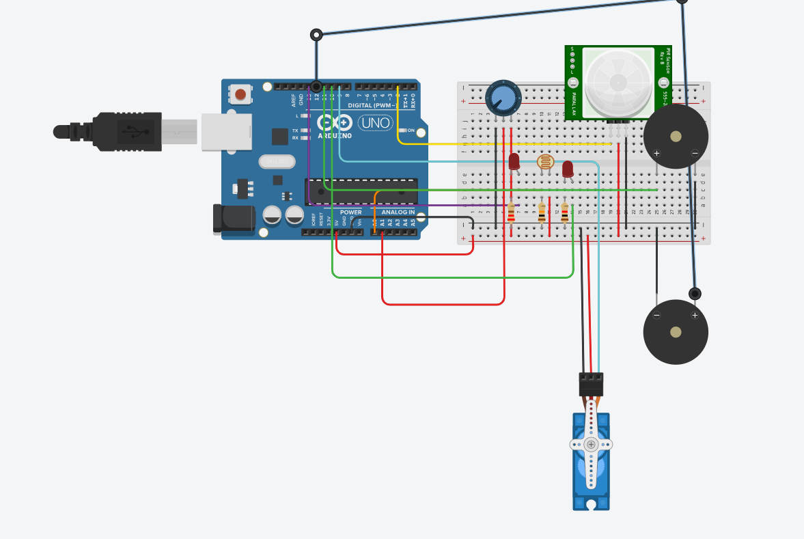

# Sensor Monitoring and Control System

## Project Overview

This project is a comprehensive sensor monitoring and control system, designed to detect flame, rain, and intruder activity, and provide real-time updates on a web-based interface. The system uses an Arduino and NodeMCU (ESP8266) to communicate with each other, gather sensor data, and host a webpage for remote monitoring and control.

## Features

- **Flame Detection**: Monitors flame sensor values and triggers an alert if a fire is detected.
- **Rain Detection**: Continuously checks for rain through the rain sensor.
- **Intruder Detection**: Uses an IR sensor to detect any motion/intrusion.
- **Servo Motor Control**: Opens or closes a window based on sensor readings.
- **Buzzer Alert**: Activates a buzzer in case of fire detection.
- **Web Interface**: Real-time sensor data monitoring and remote control through a web page hosted by the NodeMCU.

## Components Used

- **Arduino UNO**: Collects sensor data.
- **ESP8266 (NodeMCU)**: Hosts a web server and communicates with the Arduino.
- **Flame Sensor**: Detects fire.
- **IR Sensor**: Detects intrusion.
- **Rain Sensor**: Detects rain.
- **Servo Motor**: Opens/closes a window.
- **Buzzer**: Provides audio alerts.

## Circuit Design

The Arduino collects sensor values, processes them, and sends the data to the NodeMCU via serial communication. The NodeMCU then updates a web server, allowing users to view sensor data and control the servo motor and buzzer.
<div align="center">
  <h1>Circuit Design on TinkerCAD</h1>
  
</div>


## Code Explanation

### Arduino Code

- Reads values from the flame, rain, and IR sensors.
- Controls LED and buzzer based on sensor readings.
- Sends sensor data to the NodeMCU in JSON format over serial communication.

### NodeMCU Code

- Connects to the Wi-Fi network.
- Reads sensor data from the Arduino via SoftwareSerial.
- Hosts a web server with routes to display sensor readings and control the servo and buzzer.
- Serves an HTML page (from `SuperMon.h`) for the user interface.

### Web Interface (`SuperMon.h`)

- Displays sensor readings in a table.
- Provides buttons to control the servo motor and buzzer.
- Uses AJAX to fetch sensor data every second and update the UI dynamically.

## How to Run the Project

### Upload Arduino Code:
- Use the Arduino IDE to upload the sketch to the Arduino UNO.

### Upload NodeMCU Code:
- Use the Arduino IDE with ESP8266 board support to upload the sketch to the NodeMCU.

### Connect to Wi-Fi:
- Update `ssid` and `password` in the NodeMCU code.

### Open the Web Interface:
- Once connected to Wi-Fi, open the IP address of the NodeMCU in a web browser to access the control panel.

## Folder Structure

```
/project-folder
│
├── Arduino_Code.ino          # Code for Arduino
├── NodeMCU_Code.ino          # Code for NodeMCU
├── SuperMon.h                 # HTML/CSS/JS for web interface
├── server.zip                 # Additional website (to be migrated later)
├── README.md                  # This file
```

## To-Do

- [ ] Improve web interface styling
- [ ] Add cloud integration for remote access
- [ ] Optimize serial communication between Arduino and NodeMCU

## Contribution

Feel free to fork this repository, open issues, and submit pull requests. Let’s build something amazing together!

## License

This project is open-source and available under the MIT License.

## Authors

**[Puneeth](https://github.com/puneethreddy592)** <br>
**[Dhanush](https://github.com/Dhanush0147)**

Happy Monitoring! 🚀
